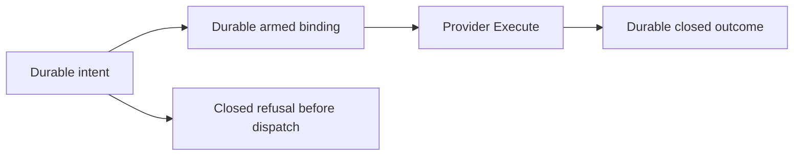

# Internal credential request journal

## Status

SQV-16 makes a durable journal mandatory for the internal credential dispatcher.
It provides request reservation, dispatch preparation, outcome persistence and
recovery on Darwin/Linux. It remains an internal foundation component: no
credential endpoint, qxctl surface, operational provider backend or Keychain
operation is enabled. Tests use real filesystem operations and kernel locks;
provider delivery and STAV transport remain fixtures.

## Identity and storage

The trusted SSIAG owner supplies an existing private state directory and exact
TOPS UUID to `NewJournal`. Construction grants no authority and creates no files.
Requests live beneath `credential-requests/<TOPS UUID>/`. Each canonical request
UUID owns a stable `.lock` and a bounded `.json` record. IDs are never recycled;
the implementation performs no retention deletion, expiry cleanup or compaction.
Lookup addresses one request directly and does not scan the collection.

The durable identity binds TOPS, request UUID, canonical subject ID/kind/authority,
kernel UID/GID and a domain-separated digest of the complete nonsecret intent.
The PID is excluded from durable identity so a legitimate process restart can
inspect its previous request. New intent timestamps, correlation ID, resource,
generation or byte ceiling produce a conflict under the same request UUID.
Current policy and authenticated identity still gate inspection and recovery.

The record stores that identity, phase, optional exact nonsecret dispatch binding,
safe outcome and a domain-separated integrity digest. It has an 8,192-byte
structural bound and an exact canonical JSON encoding. Unknown, duplicate,
omitted or trailing fields, altered digests, oversized data and invalid historical
bindings fail closed. Historical expiry is preserved rather than renewed.
The existing 4,096-byte delivery ceiling is a separate binding constraint.

No key bytes, native error text, secret-derived digest or provider payload belongs
in a record. Digests cover metadata only. The local format identifier is an
internal storage version, not an admitted IPC schema or bearer capability.

## Ordering and recovery

1. Kernel-authenticate the caller and pin current policy, as described in
   [dispatch admission](CREDENTIAL-DISPATCH.md).
2. Acquire the request's nonblocking exclusive kernel lock. Commit the exact
   `intent` record before audit or provider admission. A changed identity/intent
   conflicts; an existing record never starts a new delivery.
3. Obtain the committed STAV policy-decision receipt and the trusted provider's
   metadata pin. Validate all admission evidence and consume the one-shot guard.
4. Commit `armed` with the exact binding before calling `Execute`. If this write
   or its durability barrier fails, do not call the provider.
5. Commit a `closed` outcome before reporting completed execution. Failure to
   record completion after arming returns `indeterminate`, even if the provider
   reported success. Descriptor and provider-pin cleanup occurs on every path.

Recovery acquires the same lock and cannot classify a live attempt. It requires
a fresh, separately identified authorization request for the original exact
operation/resource/audience/scope, audits that permission check, and matches the
original authenticated subject and complete intent.

| Durable state after lock acquisition | Recovery action |
|---|---|
| `intent` | Commit `closed / not_dispatched`; provider `Execute` was not entered. Audit or metadata work may have occurred. |
| `armed` | Commit `closed / indeterminate`; delivery may have occurred. |
| `closed` | Return the retained historical outcome without another dispatch. |
| Missing/inconsistent/corrupt record or lock | Refuse recovery; missing evidence never means permission to retry. |

Recovery never invokes provider admission or execution. It does not convert
uncertainty into success or authorize a new request. A duplicate `Run` returns
`already_recorded` or `recovery_required`, not a new delivery result. The explicit
recovery result can describe an earlier `delivered` outcome; it performs no delivery.

## Filesystem guarantees and boundaries

Every directory component is opened without following symlinks. Ancestors must
be owned by root or the effective user and protected from other writers; the
root-owned sticky temporary-directory case is permitted. The state root and
journal directories are effective-user-owned mode 0700. Files must be regular,
effective-user-owned mode 0600 with one link. FIFOs, symlinks, hard links and unsafe
permissions are rejected. Only the existing macOS `/tmp`, `/var` and `/etc`
system aliases are normalized when they resolve to their known `/private` targets.

A new lock is exclusively held before its name is published without replacement.
Its descriptor and directory entry are synced before use. A missing record behind
an existing reservation, or an existing record without its original lock, refuses
fresh admission. The lock remains held through audit, preparation, execution and
outcome commitment. Mutations use a private exclusive temporary file, complete
write, file sync, atomic rename and directory sync. Recovered reads also establish
file/directory durability before reporting the record. Temporary leftovers from a
crash are never authoritative; recovery does not blindly delete them.

The lock order is policy, request journal, provider/lease/recipient, followed by
release in reverse order. Callbacks must honor their contexts and never reenter
these owners in reverse order. Synchronous filesystem durability calls do not
provide a hard execution-time guarantee when the operating system or device stalls.

This is process-crash recovery tested with SIGKILL. Storage durability assumes
the filesystem honors successful sync operations; tests do not simulate power
loss or dishonest hardware. Integrity digests detect accidental/unauthorized
record edits within the protected ownership model. They do not authenticate
privileged rewrites, whole-directory rollback or deletion of all retained state.
A future state migration must preserve reservations and outcomes; silently
starting a new journal directory cannot preserve duplicate suppression.

## Verification and remaining work

Focused tests cover independent dispatcher instances, 24 concurrent journal
claimants, four SIGKILL checkpoints, live-owner recovery refusal, six injected
persistence-failure cases, exact identity/intent conflicts, historical recovery,
missing files, unsafe paths, canonical-record corruption and idempotent recovery.
Race checks run the same cases. Darwin execution and Linux cross-compilation are
distinct evidence; Linux runtime and power-loss testing remain outside this pass.

Remaining operational gates: trusted provider/lease/recipient pins, protected
native delivery with byte/termination enforcement, signed Keychain item lifecycle,
and durable provider-outcome STAV integration. The journal is local execution
state and does not replace STAV or prove that the recipient used a credential.
